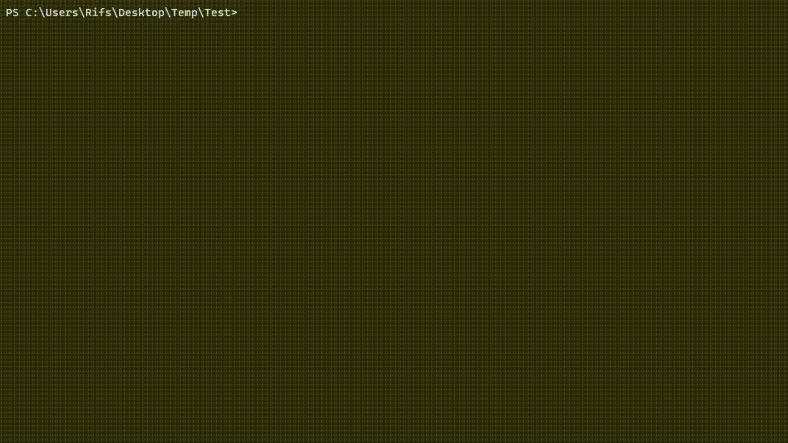

# dvpl-go
 A CLI Tool Coded In Golang To Convert WoTB ( Dava ) SmartDLC DVPL File Based On LZ4 Comrpession.

 

```

Usage :

 - Compression : "compress", "comp", "cp", "c"

 - Decompression : "decompress", "decomp", "dcp", "d"

 - Flags : "--keep-originals", "-ko", "--keep-original"

 - Help : "--help", "-h"

```

Building :

- go 1.20+ required!

```

$ git clone https://github.com/RifsxD/dvpl-go.git

```

```

$ cd dvpl-go/src/

```

```

$ go build

```